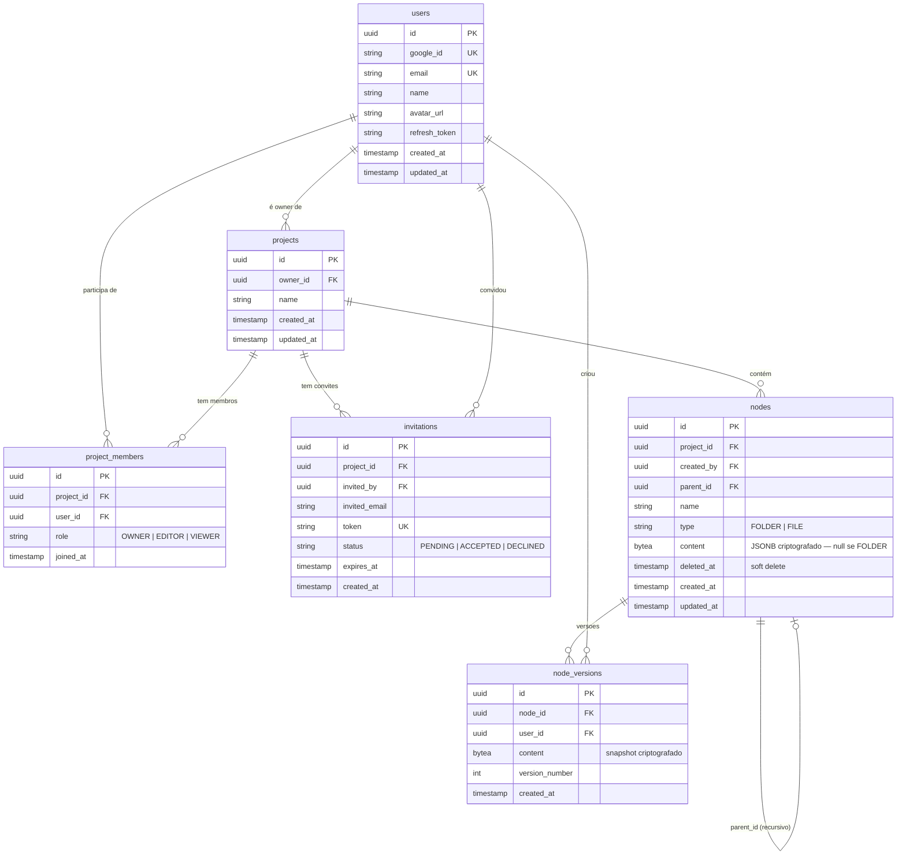

# DevDraw — Arquitetura

> Data: 2026-05-24 | Atualizado: 2026-05-29

---

## Estrutura do Repositório (Monorepo)

```
devDraw/
├── docs/
│   ├── requisitos.md
│   ├── arquitetura.md
│   └── classes.md
├── backend/                  ← NestJS (Node.js + TypeScript)
│   ├── src/
│   │   ├── auth/             ← Google OAuth2, JWT, guards
│   │   ├── users/            ← entidade User, repositório
│   │   ├── projects/         ← Project, project_members — unidade colaborativa
│   │   ├── invitations/      ← convites por e-mail com token
│   │   ├── nodes/            ← FOLDER/FILE, Recursive CTE, soft delete
│   │   ├── node-versions/    ← histórico de snapshots
│   │   ├── collaboration/    ← WebSocket Gateway, Y.js sync, presença
│   │   ├── crypto/           ← serviço AES-256-GCM (transversal)
│   │   ├── common/           ← exceptions, filters, interceptors, DTOs base
│   │   └── main.ts
│   ├── test/
│   ├── .env.example
│   └── package.json
├── frontend/                 ← React (Vite) + Tailwind CSS + TLDraw SDK
│   ├── src/
│   │   ├── features/
│   │   │   ├── auth/         ← login Google, callback, guarda de rota
│   │   │   ├── projects/     ← listagem, criação, membros, convites
│   │   │   ├── vault/        ← árvore de pastas/arquivos
│   │   │   └── canvas/       ← editor TLDraw + @tldraw/sync + presença
│   │   ├── shared/
│   │   │   ├── components/   ← Button, Modal, Sidebar, AvatarStack, etc.
│   │   │   └── api/          ← cliente HTTP (axios) + Socket.io client
│   │   ├── hooks/
│   │   └── main.tsx
│   ├── .env.example
│   └── package.json
└── docker-compose.dev.yml    ← PostgreSQL + pgAdmin para dev local
```

---

## CI/CD — Pipelines independentes no monorepo

| Parte | Pipeline | Trigger | Destino |
|---|---|---|---|
| Backend | GitHub Actions (`backend/**`) | push em `main` | Docker Hub → Watchtower → Home Server |
| Frontend | Vercel (Root Directory: `frontend/`) | push em `main` | Vercel CDN |

Cada pipeline só dispara quando arquivos do seu diretório mudam.

**Domínios:**
- API: `devdraw-api.gustavohdev.com.br` (home server, porta a definir)
- Frontend: `devdraw.gustavohdev.com.br` (Vercel)

---

## Modelo de Dados



---

## Endpoints REST

```
Auth
  GET  /auth/google                           → redireciona para OAuth Google
  GET  /auth/google/callback                  → callback, emite JWT
  POST /auth/refresh                          → renova access token
  POST /auth/logout                           → revoga refresh token

Users
  GET  /users/me                              → perfil do usuário autenticado

Projects
  GET  /projects                              → lista projetos do usuário (owner + membro)
  POST /projects                              → criar projeto
  GET  /projects/:id                          → detalhe do projeto
  PATCH /projects/:id                         → renomear (owner only)
  DELETE /projects/:id                        → excluir projeto (owner only)

Project Members
  GET  /projects/:id/members                  → listar membros e papéis
  PATCH /projects/:id/members/:userId         → alterar papel de membro (owner only)
  DELETE /projects/:id/members/:userId        → remover membro (owner only)

Invitations
  POST /projects/:id/invitations              → convidar por e-mail (owner only)
  GET  /invitations/:token                    → consultar convite (público)
  POST /invitations/:token/accept             → aceitar convite
  POST /invitations/:token/decline            → declinar convite
  DELETE /projects/:id/invitations/:invId     → cancelar convite pendente (owner only)

Nodes
  GET  /projects/:id/nodes                    → árvore completa do projeto (Recursive CTE)
  GET  /projects/:id/nodes/:nodeId            → nó único (conteúdo descriptografado)
  POST /projects/:id/nodes                    → criar nó (FOLDER ou FILE)
  PATCH /projects/:id/nodes/:nodeId           → renomear ou mover (parent_id)
  PATCH /projects/:id/nodes/:nodeId/content   → salvar canvas (auto-save)
  DELETE /projects/:id/nodes/:nodeId          → soft delete

Node Versions
  GET  /projects/:id/nodes/:nodeId/versions              → listar versões
  GET  /projects/:id/nodes/:nodeId/versions/:vid         → snapshot de versão específica
  POST /projects/:id/nodes/:nodeId/versions/:vid/restore → restaurar versão
```

---

## WebSocket — Eventos de Colaboração

Conexão: `ws://devdraw-api.gustavohdev.com.br/collaboration?token=<jwt>`

Rooms: cada canvas aberto representa uma room identificada por `nodeId`.

```
Cliente → Servidor
  join-canvas    { nodeId }          → entra na room do canvas
  leave-canvas   { nodeId }          → sai da room
  sync-update    { nodeId, update }  → Y.js binary update (CRDT diff)
  presence       { nodeId, cursor, userId } → posição do cursor

Servidor → Clientes da room
  sync-update    { update }          → propaga Y.js update para os demais
  presence       { userId, cursor, name, avatarUrl } → estado de presença
  user-joined    { userId, name, avatarUrl } → novo colaborador entrou
  user-left      { userId }          → colaborador saiu
```

O servidor persiste o estado Y.js completo do documento a cada 30s e ao receber `leave-canvas` do último cliente.

---

## Decisões Técnicas

| Decisão | Justificativa |
|---|---|
| NestJS (não Express puro) | Módulos, DI, guards e interceptors nativos — estrutura próxima ao Spring Boot |
| PostgreSQL + JSONB | Flexibilidade para o schema do TLDraw sem migrations a cada mudança de shape |
| Recursive CTE | Consulta eficiente de árvore sem múltiplos roundtrips ao banco |
| `content` como `bytea` | AES-256-GCM produz bytes; `bytea` é mais correto que `text` para dado binário |
| `deleted_at` (soft delete) | Permite recuperação e não quebra FKs de `node_versions` |
| Refresh token rotativo | Revogação efetiva sem estado server-side pesado |
| TLDraw SDK + `@tldraw/sync` | API de exportação rica, store tipado e sync CRDT nativo — não requer solução custom |
| Y.js (CRDT) | Garante convergência de edições simultâneas sem locks ou last-write-wins — padrão da indústria para colaboração offline-first |
| Chave de criptografia por projeto | Todos os membros precisam descriptografar o mesmo conteúdo; chave derivada de `masterKey + project_id` |
| `Project` como unidade colaborativa | Separa ownership de membership; isola árvores de nós por contexto, não por usuário |
| Monorepo simples | Projeto de uso individual — overhead de Nx/Turborepo não compensa |
| Docker Compose apenas para dev | PostgreSQL + pgAdmin local; apps rodam com `npm run dev` |
