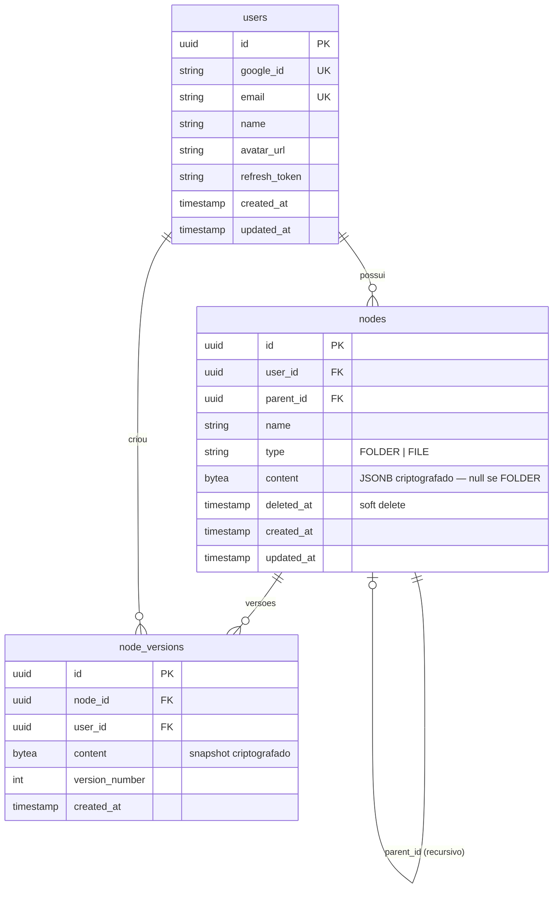

# DevDraw — Arquitetura

> Data: 2026-05-24

---

## Estrutura do Repositório (Monorepo)

```
devDraw/
├── docs/
│   ├── requisitos.md
│   ├── arquitetura.md
│   └── classes.md
├── backend/                  ← NestJS (Node.js + TypeScript)
│   ├── src/
│   │   ├── auth/             ← Google OAuth2, JWT, guards
│   │   ├── users/            ← entidade User, repositório
│   │   ├── nodes/            ← FOLDER/FILE, Recursive CTE, soft delete
│   │   ├── node-versions/    ← histórico de snapshots
│   │   ├── crypto/           ← serviço AES-256-GCM (transversal)
│   │   ├── common/           ← exceptions, filters, interceptors, DTOs base
│   │   └── main.ts
│   ├── test/
│   ├── .env.example
│   └── package.json
├── frontend/                 ← React (Vite) + Tailwind CSS + TLDraw SDK
│   ├── src/
│   │   ├── features/
│   │   │   ├── auth/         ← login Google, callback, guarda de rota
│   │   │   ├── vault/        ← árvore de pastas/arquivos
│   │   │   └── canvas/       ← editor TLDraw + auto-save
│   │   ├── shared/
│   │   │   ├── components/   ← Button, Modal, Sidebar, etc.
│   │   │   └── api/          ← cliente HTTP (axios)
│   │   ├── hooks/
│   │   └── main.tsx
│   ├── .env.example
│   └── package.json
└── docker-compose.dev.yml    ← PostgreSQL + pgAdmin para dev local
```

---

## CI/CD — Pipelines independentes no monorepo

| Parte | Pipeline | Trigger | Destino |
|---|---|---|---|
| Backend | GitHub Actions (`backend/**`) | push em `main` | Docker Hub → Watchtower → Home Server |
| Frontend | Vercel (Root Directory: `frontend/`) | push em `main` | Vercel CDN |

Cada pipeline só dispara quando arquivos do seu diretório mudam.

**Domínios:**
- API: `devdraw-api.gustavohdev.com.br` (home server, porta a definir)
- Frontend: `devdraw.gustavohdev.com.br` (Vercel)

---

## Modelo de Dados



---

## Endpoints REST

```
Auth
  GET  /auth/google                        → redireciona para OAuth Google
  GET  /auth/google/callback               → callback, emite JWT
  POST /auth/refresh                       → renova access token
  POST /auth/logout                        → revoga refresh token

Users
  GET  /users/me                           → perfil do usuário autenticado

Nodes
  GET  /nodes                              → árvore completa (Recursive CTE)
  GET  /nodes/:id                          → nó único (conteúdo descriptografado)
  POST /nodes                              → criar nó (FOLDER ou FILE)
  PATCH /nodes/:id                         → renomear ou mover (parent_id)
  PATCH /nodes/:id/content                 → salvar canvas (auto-save)
  DELETE /nodes/:id                        → soft delete

Node Versions
  GET  /nodes/:id/versions                 → listar versões
  GET  /nodes/:id/versions/:vid            → snapshot de versão específica
  POST /nodes/:id/versions/:vid/restore    → restaurar versão
```

---

## Decisões Técnicas

| Decisão | Justificativa |
|---|---|
| NestJS (não Express puro) | Módulos, DI, guards e interceptors nativos — estrutura próxima ao Spring Boot |
| PostgreSQL + JSONB | Flexibilidade para o schema do TLDraw sem migrations a cada mudança de shape |
| Recursive CTE | Consulta eficiente de árvore sem múltiplos roundtrips ao banco |
| `content` como `bytea` | AES-256-GCM produz bytes; `bytea` é mais correto que `text` para dado binário |
| `deleted_at` (soft delete) | Permite recuperação e não quebra FKs de `node_versions` |
| Refresh token rotativo | Revogação efetiva sem estado server-side pesado |
| TLDraw SDK | API de exportação rica, store tipado, melhor suporte TypeScript |
| Monorepo simples | Projeto de uso individual — overhead de Nx/Turborepo não compensa |
| Docker Compose apenas para dev | PostgreSQL + pgAdmin local; apps rodam com `npm run dev` |
